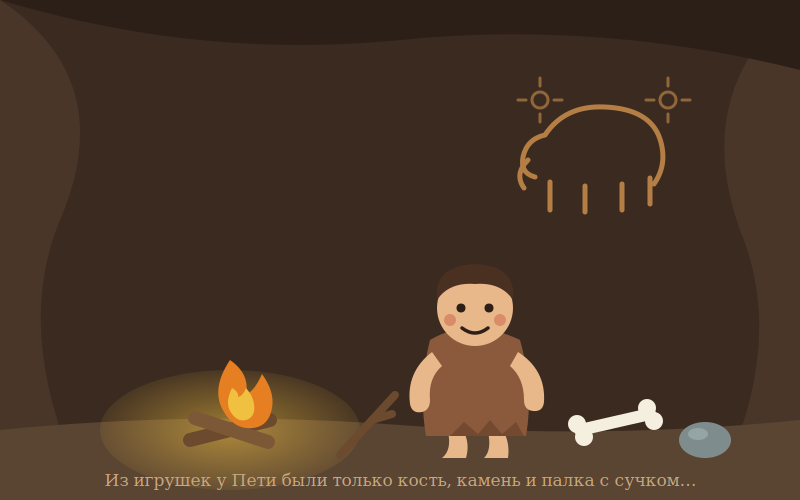
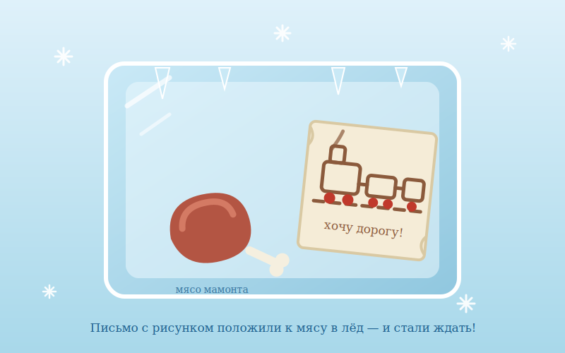

# Глава 1. Откуда появились Деды Морозы

❄ ❅ ❄

Деды Морозы появились в стародавние времена. Тогда ещё никто не знал мобильных телефонов, компьютеров и электричек. Люди ходили в шкурах, охотились на мамонтов и едва сводили концы с концами.

Тогда в одной из пещер Стародавнего мира родился маленький мальчик. Звали его Петя. Из игрушек у Пети были только небольшая кость мамонта, камень и палка с сучком. Это, конечно, были хорошие игрушки для тех времён. Но Петя чувствовал, что чего-то не хватает. Нет, мы вовсе не хотим сказать, что Петя был капризным мальчиком — из тех, которым постоянно мало игрушек и которые, лишь завидев магазин, устраивают родителям концерт по заявкам. Нет. Петя был послушный и благовоспитанный мальчик.

Он сам переодевал шкуру для спанья в шкуру для хождения по пещере. Сам умывался в реке, которая протекала как раз у входа в его родную пещеру. Сам шёл завтракать, с удовольствием ел кашу, а затем пил чай из листьев душистого дерева Хо-Хо.

Но чего-то не хватало.

— Мама, — как-то раз сказал Петя, — а где мне взять новые игрушки?

— Какие игрушки? — спросила мама. — Что это такое?

— Ну, не знаю, — ответил Петя. — Я бы хотел во что-то новое поиграть!

— Но у тебя есть палка, кость и камень!

— Да, но я хочу железную дорогу!

— Что?! Какую дорогу? Сейчас каменный век! Мы только что освоили элементарные орудия труда!

— Понятное дело, — сказал Петя. — А мне что делать? Я хочу дорогу!

— Хм, — сказала мама. — А ведь ты и правда хорошо себя вёл в этом году! Почему бы тебе не получить железную дорогу, что бы это ни значило. Вот только где её взять?

— Я придумал! — сказал Петя. — Давай напишем письмо Деду Морозу!

— Что?! — сказала мама. — Какому деду? Ты откуда это взял?

— Не знаю, — ответил Петя. — Мне сон такой приснился!

— Расскажешь? — спросила мама.

— Конечно! Значит, просыпаюсь я почему-то первого января, а у нас дома дерево такое стоит — пушистое какое-то, зелёное и с иголками. А под деревом, в шкуре волчьей, завёрнуто что-то. Я, значит, подошёл, развернул шкуру, а там — железная дорога! Да какааая! Радость, да и только. Я как давай с ней играть! И Вовку позвал, и Серёгу, и Светку из соседней пещеры.

— Угу, — сказала мама. — А при чём тут Дед Мороз?

— А-а, это самое главное! Перед этим я положил пергамент с рисунком железной дороги в холодильник — ну, место это, где мы мясо мамонта храним, во льду.

— М-м-м! — промычала мама. — Интересно! А давай так и попробуем сделать!

Ну и сделали они так! А как раз стоял конец декабря. Письмо с рисунком положили к мясу в лёд. Нашли в лесу дерево такое — с иголками, зелёное, небольшое. Притащили домой и поставили.

И стали ждать!

В этот самый момент где-то на краю света в сугробе что-то зашевелилось.

— Хо-хо! — раздался звук. — Кто я?..

Снежная шапка отвалилась, и из глубины показалась фигура. На вид она была довольно странная: огромная белая борода, красные щёки, варежки, колпак и большие чёрные сапоги с отворотами.

— Похоже, кто-то хочет подарок! — сказала фигура. — Железную дорогу!

Спустя пару минут фигура полностью освободилась от снега, хорошенько подпоясалась и зашагала прочь по заснеженной тропинке.

*Так родилась история длиною в жизнь…*
